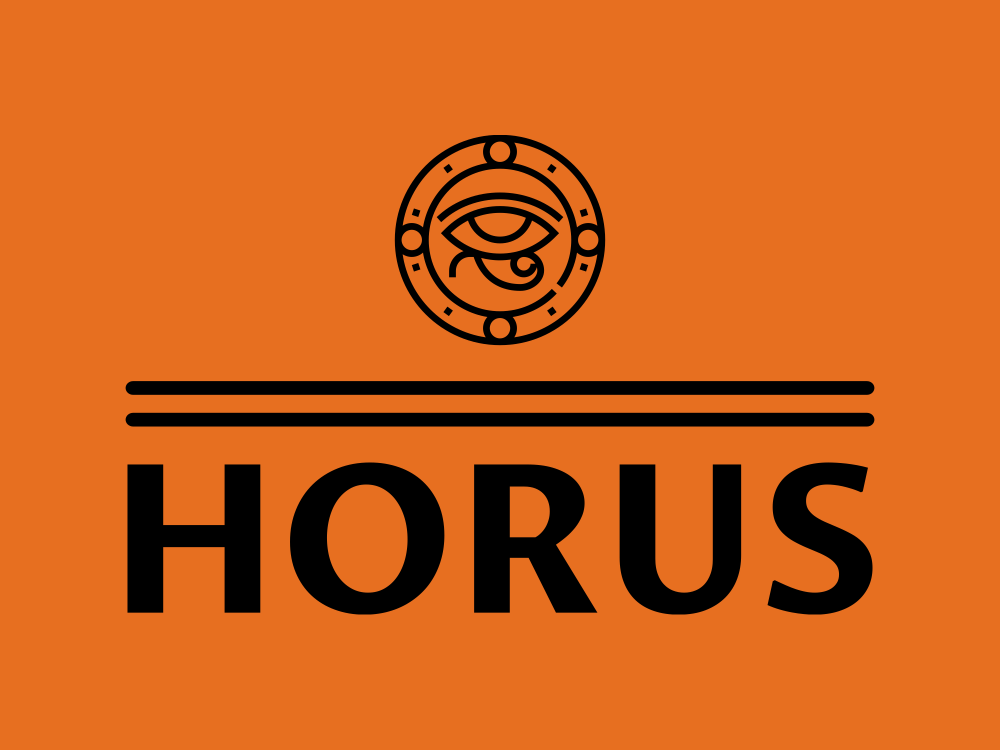
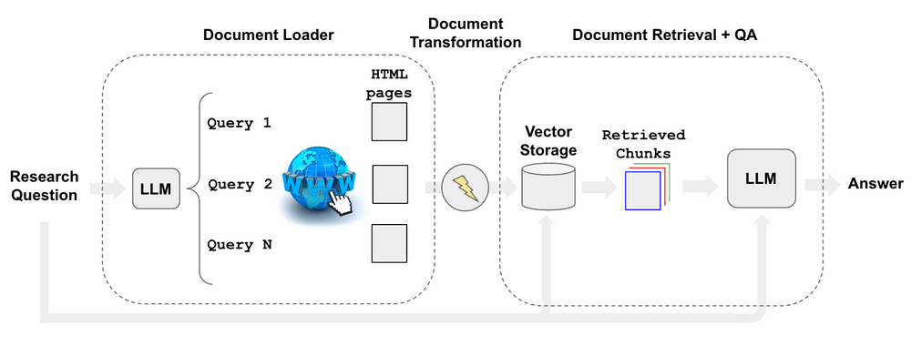
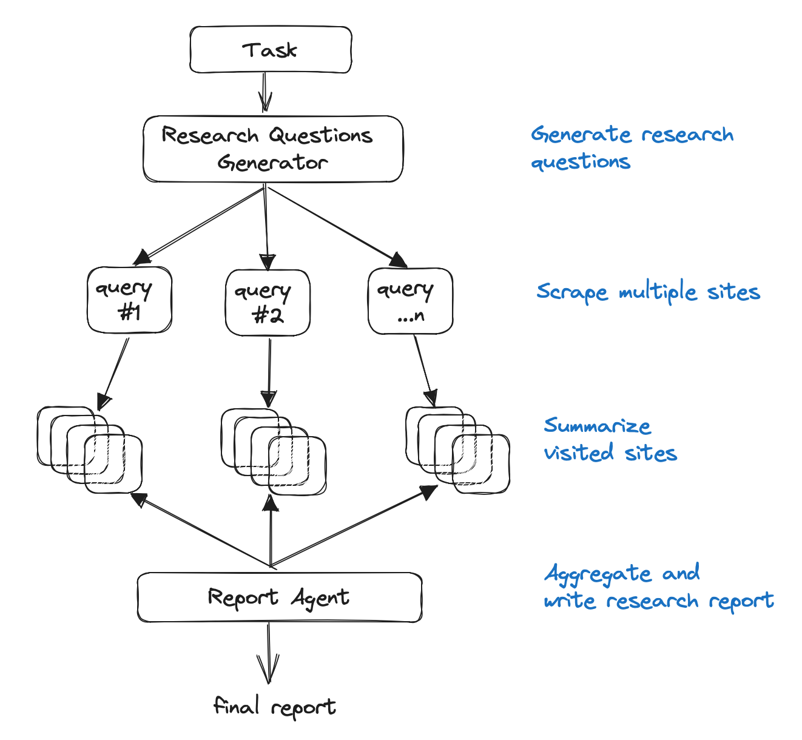
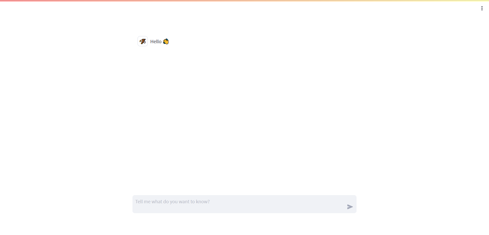
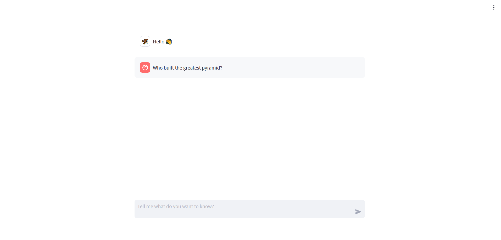
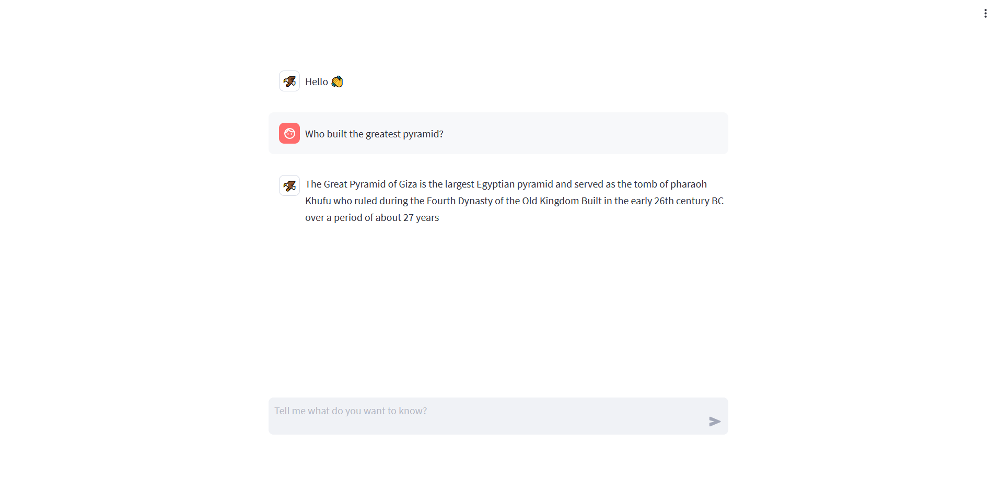

# HORUS CHATBOT 

A chat bot based on research automation technique using Llama-2 model for helping tourists to gain more info about Ancient Egyptian civilization in frinendly chating way.
# Used Technologies
- Llama-2
- langchain
- torch
- huggingface
- streamlit
# Workflow
    - Use an LLM to generate multiple relevant search queries (one LLM call).
    - Execute a search for each query.
    - Choose the top K links per query  (multiple search calls in parallel).
    - Load the information from all chosen links (scrape pages in parallel).
    - Index those documents into a vectorstore.
    - Find the most relevant documents for each original generated search query.
  

# How to use?
1. Clone repo
2. Install requirements
3. Add your API tokens
4. Run app.py
# Sceenshots
 

 

